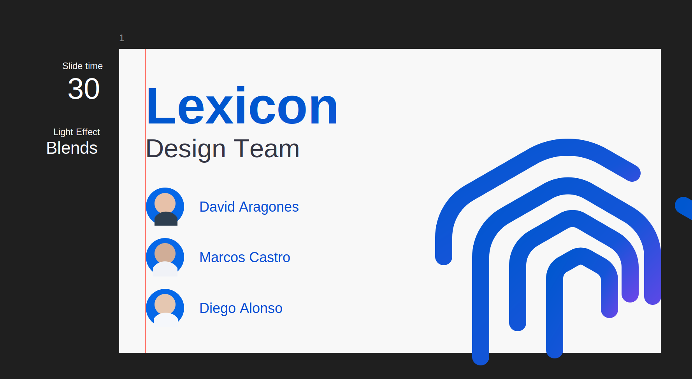
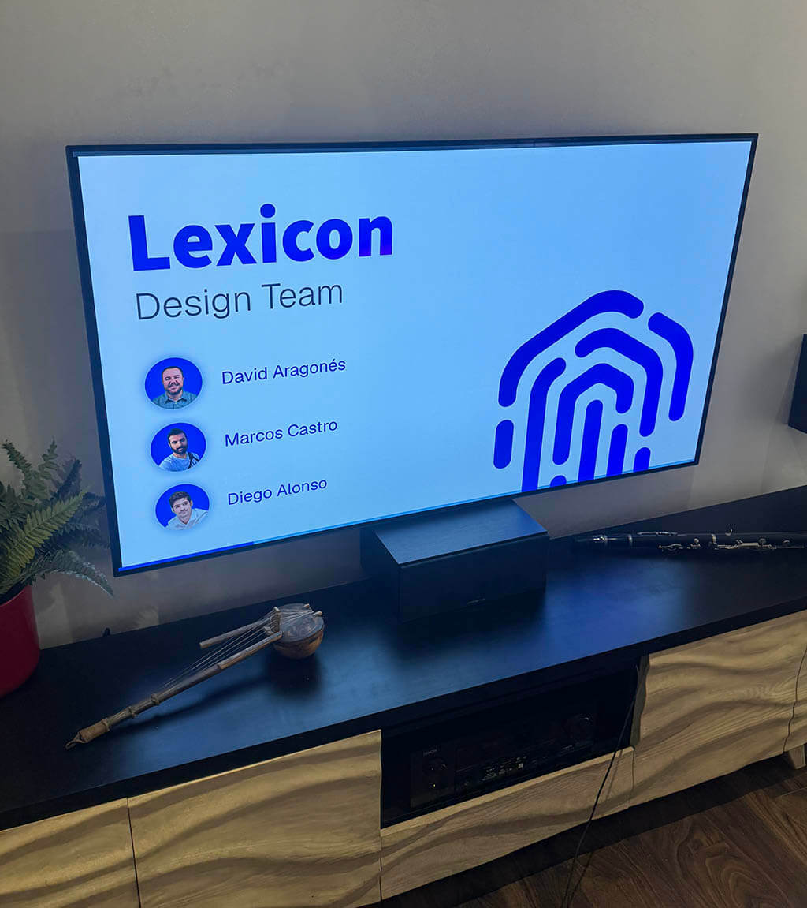

# Office Figma Viewer

Slide carousel for an office display driven by a Raspberry Pi kiosk browser.

The app runs through a small dependency-free Node server. It reads a configured Figma file, exports numbered frames from a page as clipped JPG images, and displays them in sequence with a blue progress bar.

## Usage

Kiosk URL:

```text
http://localhost:7777/index.html
```

Remote admin page:

```text
http://<device-hostname-or-ip>:7777/admin.html
```

For example, on the current Raspberry Pi:

```text
http://raspberrydesign:7777/admin.html
```

Paste a Figma personal access token into the admin page and click `Save`. The token is stored in `carousel-config.json` on the Raspberry Pi, not in the repository.

## Raspberry Pi

Deployment directory:

```text
/home/pi/design-dashboard-carousel
```

systemd service:

```text
design-dashboard-carousel.service
```

Useful commands:

```bash
sudo systemctl status design-dashboard-carousel.service
sudo systemctl restart design-dashboard-carousel.service
journalctl -u design-dashboard-carousel.service -n 50 --no-pager
```

## Figma

Configured file:

```text
https://www.figma.com/design/BidKDsJvOdDy0xuFXEMg1F/Design-Dashboard
```

Expected page:

```text
carousel
```

Each slide must be a top-level frame on that page with a numeric name:

```text
1
2
3
4
```

The carousel order is based on those numeric frame names.

Visual reference for the expected Figma structure:



Each frame is exported with these Figma image parameters:

```text
format=jpg
scale=1
contents_only=true
use_absolute_bounds=true
```

For `1920x1080` frames, `scale=1` keeps the exported image at `1920x1080`. `use_absolute_bounds=true` prevents content outside the frame bounds from being included in the export.

## Slide Duration

Each frame may include:

```text
Time
└── Seconds
```

`Seconds` must be a text node containing the number of seconds. Valid examples:

```text
15
15s
15 seconds
```

If the value is missing, empty, or unreadable, the carousel uses `15` seconds.

## Light Effects

Light effects are optional. The carousel works fully without any lighting hardware.

If available, the viewer can send WLED playlist commands to an extra WLED device through WebSocket. This is only used to synchronize ambient lights with each slide.

Each frame may include:

```text
Effect
└── type
```

Supported values:

```text
none
Chase
Blends
Dancing
```

`none` sends nothing. The other values send a payload through WebSocket:

```text
ws://designlights.local/ws
```

If that WebSocket host is missing, offline, or unreachable, slides continue normally and only the light effect is skipped.

`type` may be a Figma component instance with a variant property. The viewer reads `componentProperties.type.value` first and falls back to the visible child text.

## Refresh

The viewer polls every 30 seconds. On each tick it:

- Reads the local server config (`/api/carousel-config`). If the token, file key, or page name changed since the last tick, it forces a full reload.
- Otherwise it checks the Figma file `lastModified` and reloads the frames and images only when Figma has changed.

This means saving from `admin.html` is reflected on the kiosk within ~30 seconds, without manual reload.

## Visible Errors

The carousel shows a black error screen when:

- No token is configured.
- The token is expired or does not have access.
- The configured Figma page does not exist.
- No numbered frames are found.
- Figma does not return exportable images.

While an error screen is visible, the viewer automatically retries after 10 minutes by performing a full page reload. If the reload succeeds the error clears; otherwise it keeps retrying every 10 minutes until Figma is reachable again.

## Files

```text
server.js              HTTP server on port 7777 + configuration API.
carousel-config.json   Empty default config; local deployments store the real token here.
public/index.html      Kiosk carousel.
public/admin.html      Remote configuration page.
DEPLOY.md              systemd and kiosk autostart installation notes.
README.md              Usage guide.
MODELS.md              Data contract and expected Figma structure.
OPS.md                 Operations and troubleshooting.
```

## Notes

- The admin page has no authentication. It is intended for a controlled local network.
- The Figma token must not be committed. Keep it only in the Raspberry Pi `carousel-config.json`.
- Slide transitions use a simple opacity fade for low resource usage.
- The bottom progress bar is `8px` high and adapts to each slide duration.
- Error screens link to the admin page using the current browser origin, so deployments on other hostnames or IP addresses work without code changes.

## TV Browser Support

The viewer can work in a TV browser if the browser supports modern enough JavaScript features used by the app: `fetch`, `Promise`, `WebSocket`, and basic CSS transitions. Many recent WebOS, Tizen, and Android TV browsers do, but older TV browsers can be inconsistent.

Tested successfully on an LG TV from 2020:



For reliable signage, the Raspberry Pi kiosk remains the preferred runtime. It gives predictable Chromium behavior, autostart, and easier remote administration.
